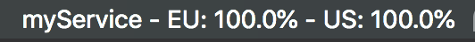
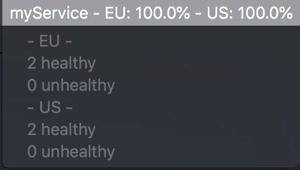

# AWS load balancer healthy state menu bar for Mac OS

This tool outputs a simple title and sub-menu in your Mac OS menu bar with health status of your instances in the defined ELBs.

## Installation

1. You need to install Hammerspoon (https://www.hammerspoon.org/)

> This is a tool for powerful automation of OS X. At its core, Hammerspoon is just a bridge between the operating system and a Lua scripting engine. What gives Hammerspoon its power is a set of extensions that expose specific pieces of system functionality, to the user.

2. Move `init.lua` to `~/.hammerspoon/init.lua

## Configuration

Inside the function `buildInterface`
  1. You need to edit the title, line 42: `local title = { "myService" }`
  2. You need to edit the table, line 44 `loadBalancerMonitored` that you want to monitor

  Example:
  ```
  		local loadBalancerMonitored = {
			{ profile = "default", region = "eu-west-1", regionShort = "EU", loadBalancerName = "myLoadBalancer" }
		}
   ```

   * profile: The AWS profile to use while calling the AWS API
   * region: Region where the ELB is located
   * regionShort: Region where the ELB is located. This value is used for the title and sub-menu
   * loadBalancerName: The loadbalancer health to monitor
   
   3. You can also change the timer tick, line 70 ` hs.timer.doEvery(300, constructInterface)`

## Tool running




